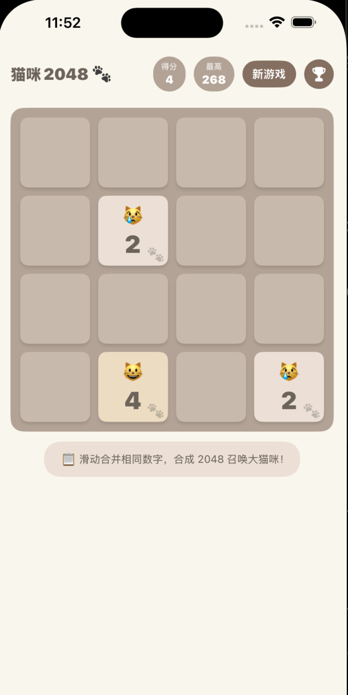
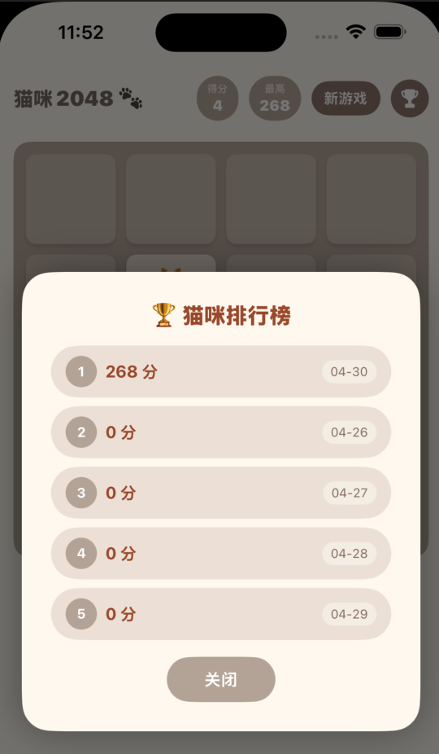
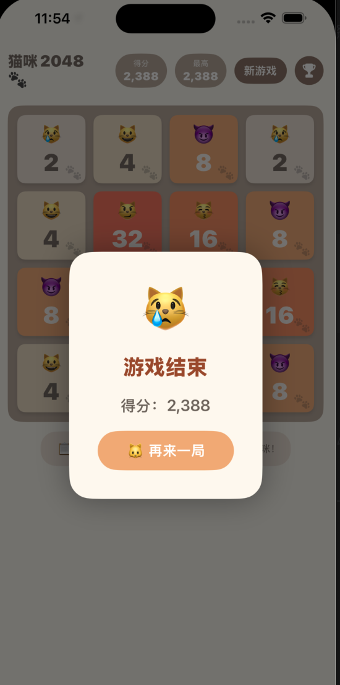

# Cat2048 iOS

一款以猫咪为主题的 2048 益智游戏，使用 SwiftUI 开发，支持 iOS 16+。

## 截图

<p align="center">
  
  
  
</p>

## 功能特性

- 经典 2048 玩法，滑动合并相同数字方块
- 猫咪主题皮肤，不同数值对应不同猫咪图案
- 分数记录与排行榜
- 胜利/失败弹窗提示
- 本地数据持久化

## 技术栈

- SwiftUI
- MVVM 架构
- Swift Package Manager / XcodeGen（`project.yml`）

## 项目结构

```
Cat2048/
├── Model/
│   ├── ScoreRecord.swift      # 分数记录模型
│   ├── StorageService.swift   # 本地存储服务
│   └── TileTheme.swift        # 方块主题配置
├── View/
│   ├── GameView.swift         # 主游戏界面
│   ├── BoardView.swift        # 棋盘视图
│   ├── TileView.swift         # 方块视图
│   ├── ScoreHeaderView.swift  # 分数头部
│   ├── GameOverModalView.swift
│   ├── WinModalView.swift
│   └── LeaderboardModalView.swift
├── ViewModel/
│   └── GameViewModel.swift    # 游戏逻辑
└── Cat2048App.swift
```

## 运行方式

1. 克隆仓库
2. 用 Xcode 打开 `Cat2048/Cat2048.xcodeproj`
3. 选择模拟器或真机，运行即可

## 开发参考

详见 [iOS 休闲游戏开发指南](iOS_Game_Development_Guide.md)，涵盖引擎选择、SpriteKit 核心概念、手感打磨、变现策略等内容。

## License

MIT
